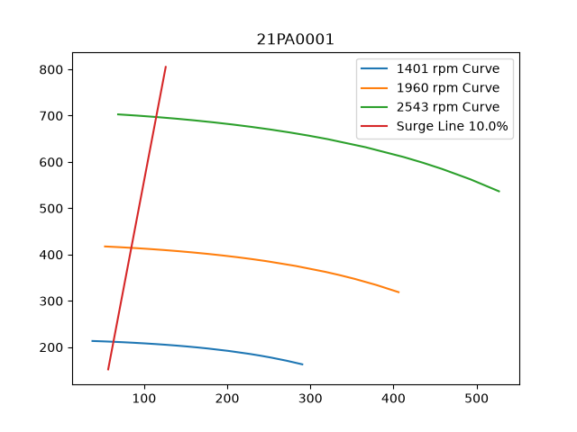
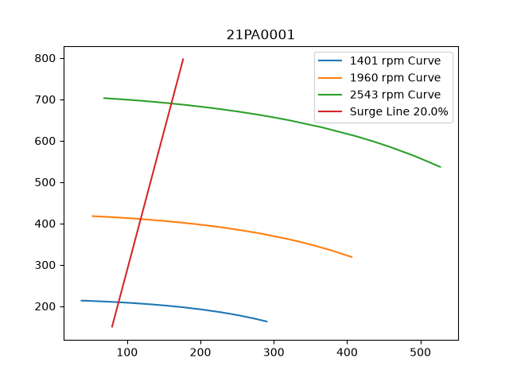
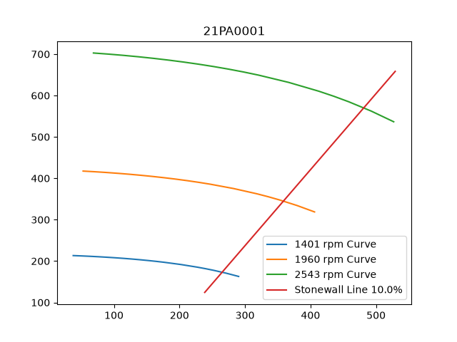
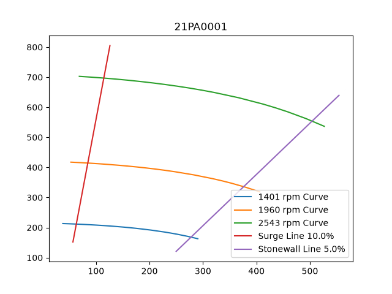

# Surge and Stonewall Curves for Rotating Equipment
This repository contains code to calculate surge and stonewall curves for rotating equipment in UniSim, such as pumps and compressors. The code is written in Python and uses the following libraries:
- matplotlib
- numpy
- pandas
- pathlib

## How to use the code
1. Clone the repository to your local machine.

2. Install the required libraries using pip:

```
pip install pandas numpy matplotlib
```
Alternatively, if you use UV, you can run:
```
uv add numpy pandas matplotlib
```

3. Place your UniSim curve data in the "Curves" folder. The data should be in CSV format and should contain columns for speed, flow rate and head. The column names should start with "Speed", "Flow" and "Head" respectively.

4. Run the main.py file. The program will ask for Equipment name and percentage margin to the Surge and Stonewall lines. This will calculate the surge and stonewall curves and save copyable tsv-files into the "Surge_Line" and "Stonewall_Line" folders respectively. Plots of the constraining lines are saved in the "Plots" folder.

5. Open the generated tsv files and copy the data into your UniSim model to create the surge and stonewall curves. Remember that in UniSim Steady State, the curves may have to be implemented thorugh a spreadsheet.

## Calculation method

### Surge Line 

The surge line was calculated by finding two points. The first point is the surge point on the lowest speed curve. The second point is the surge point on the highest speed curve. The point is defined as a margin from the end of the curve. This curve is given as a percentage of the whole span of flow rates for that particualr speed. The surge point is calculated as follows:

$$
\text{Surge Point} = F_{min} + (F_{max} - F_{min}) \cdot margin\%
$$


Where $F_{min}$ is the minimum flow rate for that speed, $F_{max}$ is the maximum flow rate for that speed and $margin$ is the percentage margin from the end of the curve.

The two boundary points are then used to fit a linear curve, which is the surge line. The surge line is then plotted together with the low speed and high speed curves.

#### Plot of the Surge Line

Here is an example of the surge line with 10\% margin and one with 20\% margin. The surge line is plotted together with the low speed and high speed curves.





### Stone Wall Line

The same principle is used to calculate the stone wall. However, the equation for getting the stone wall points are slightly different. The stone wall points are calculated as follows:

$$
\text{Stone Wall Point} = F_{max} - (F_{max} - F_{min}) \cdot margin\%
$$

#### Plot of the Stone Wall Line
The stone wall line is created similarly to the surge line. Here is an example of the stone wall line with 10\% margin.



#### Plot of both Constraining Lines (Surge and Stone Wall)
Here is an example of both the surge line and the stone wall line with 10\% margin.



## Closing remarks

The code is intended to be a starting point for calculating surge and stone wall curves for rotating equipment in UniSim. The method used to calculate the surge and stone wall points is based on a percentage margin from the end of the curve, which may not be the most accurate method for all types of equipment. It is recommended to validate the calculated curves with actual data from the equipment or with more advanced methods if necessary.

I'm always open for suggestions on how to improve the code or the method used to calculate the surge and stone wall curves. Feel free to open an issue or submit a pull request if you have any ideas or improvements.

Pumpkins and Penguins

-Jørgen Skjæveland