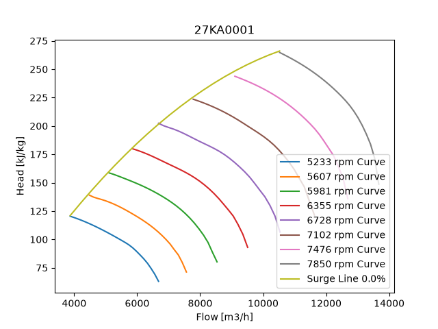
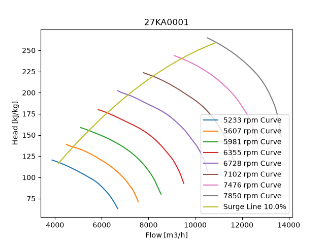
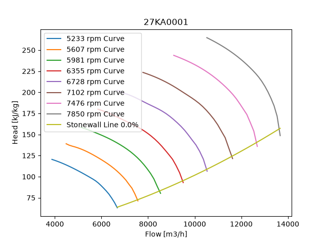
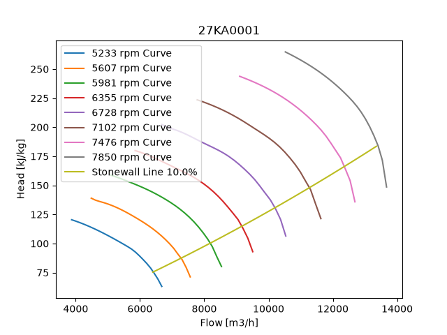
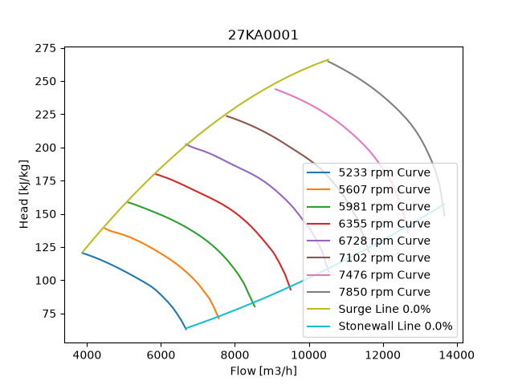

# Surge and Stonewall Curves for Rotating Equipment
This repository contains code to calculate surge and stonewall curves for rotating equipment in UniSim, such as pumps and compressors. The code is written in Python and uses the following libraries:
- matplotlib
- numpy
- pandas
- pathlib

## How to use the code
1. Clone the repository to your local machine.

2. Install the required libraries using pip:

```
pip install pandas numpy matplotlib
```
Alternatively, if you use UV, you can run:
```
uv add numpy pandas matplotlib
```

3. Place your UniSim curve data in the "Curves" folder. The data should be in CSV format and should contain columns for speed, flow rate and head. The column names should start with "Speed", "Flow" and "Head" respectively.

4. Run the main.py file. The program will ask for Equipment name, percentage margin to the Surge and Stonewall curves as well as units for head and volumetric flow. This will calculate the surge and stonewall curves and save copyable tsv-files into the "Surge_Line" and "Stonewall_Line" folders respectively. A simple tsv-file with the polynomial coefficients are also added to the "Surge_Line" and "Stonewall_Line" folders. Plots of the constraining curves are saved in the "Plots" folder.

5. Open the generated tsv files and copy the data into your UniSim model to create the surge and stonewall curves. 

## Calculation method

### Surge Curve 

The surge curve was calculated by generating a polynomial passing through each of the speed curves. Each curve has a minimum flow, to avoid surge. Each speed curves' minimum flow is scaled using the margin given by the user. This flow is given as a percentage of the whole span of flow rates for that particualr speed. The surge flows are calculated as follows:

$$
\text{Surge Flow} = F_{min} + (F_{max} - F_{min}) \cdot margin\%
$$


Where $F_{min}$ is the minimum flow rate for that speed, $F_{max}$ is the maximum flow rate for that speed and $margin$ is the percentage margin from the end of the curve.

Each speed curve generates a surge point, which is then used to create a polynomial passing through all the surge points. The polynomial is then used to generate the control curve.

#### Plot of the Surge Curve

Here is an example of the surge curve with 10\% margin and one with 20\% margin. The surge curve is plotted together with the low speed and high speed curves.





### Stone Wall Curve

The same principle is used to calculate the stone wall. However, the equation for getting the stone wall points are slightly different. The stone wall points are calculated as follows:

$$
\text{Stone Wall Point} = F_{max} - (F_{max} - F_{min}) \cdot margin\%
$$

#### Plot of the Stone Wall Curve
The stone wall curve is created similarly to the surge curve. Here is an example of the stone wall curve with 10\% margin.





#### Plot of both Constraining Curves (Surge and Stone Wall)
Here is an example of both the surge curve and the stone wall curve with 10\% margin.



## Closing remarks

The code is intended to be a starting point for calculating surge and stone wall curves for rotating equipment in UniSim. The method used to calculate the surge and stone wall points is based on a percentage margin from the end of the curve, which may not be the most accurate method for all types of equipment. It is recommended to validate the calculated curves with actual data from the equipment or with more advanced methods if necessary.

I'm always open for suggestions on how to improve the code or the method used to calculate the surge and stone wall curves. Feel free to open an issue or submit a pull request if you have any ideas or improvements.
